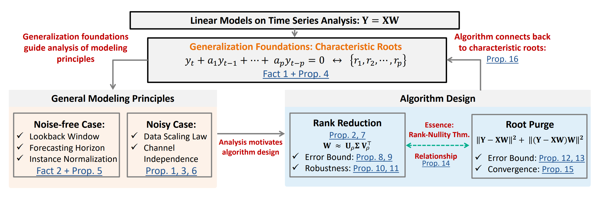
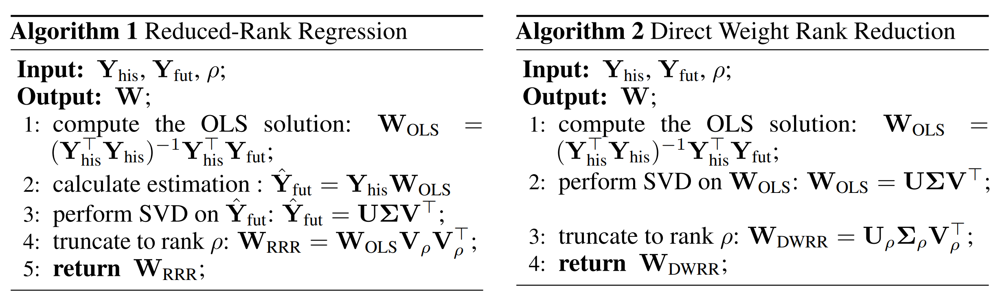
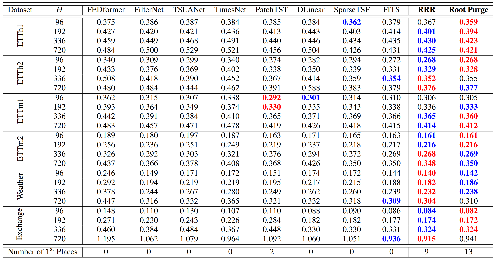
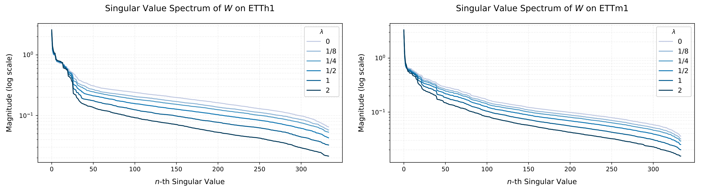
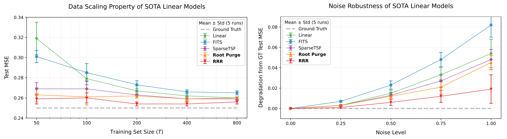
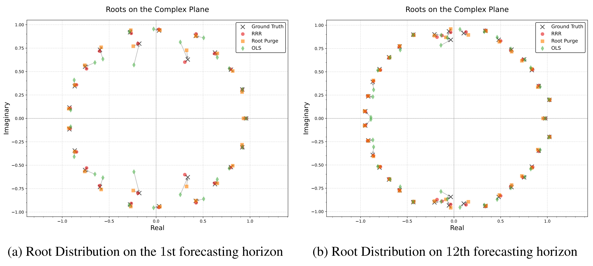
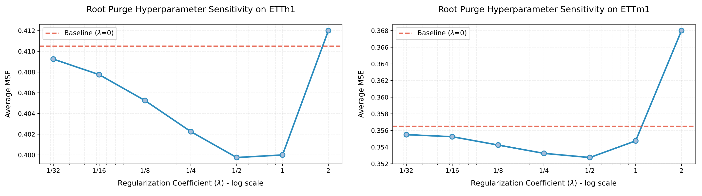

<div align="center">

<!-- TODO: Add a teaser figure (e.g., roadmap or mind map of the paper) -->
<!--  -->

<h1>RootPurge</h1>
<h3>Characteristic Root Analysis and Regularization for Linear Time Series Forecasting</h3>

[Zheng Wang](https://github.com/Wangzzzzzzzz)<sup>:email:</sup>, Kaixuan Zhang, Wanfang Chen, Xiaonan Lu, Longyuan Li, Tobias Schlagenhauf

Bosch (China) Investment Co., Ltd. & Robert Bosch GmbH

(<sup>:email:</sup>) corresponding author: david.wang3@cn.bosch.com

Accepted to ICLR 2026!

[](https://arxiv.org/abs/2509.23597)&nbsp;
[](https://github.com/Wangzzzzzzzz/RootPurge)&nbsp;

</div>

## Updates

🚩 **`Jan. 2026`:** Our paper is accepted to ICLR 2026!

🚩 **`Sep. 2025`:** We released our paper on [arXiv](https://arxiv.org/abs/2509.23597). Code is available at [GitHub](https://github.com/Wangzzzzzzzz/RootPurge).

## Table of Contents
- [Introduction](#introduction)
- [Method](#method)
- [Main Results](#main-results)
- [Model Analysis](#model-analysis)
- [Getting Started](#getting-started)
- [Acknowledgement](#acknowledgement)
- [Citation](#citation)

## Introduction

Time series forecasting is critical across domains like weather, energy, and finance, yet no single model dominates all settings. Recent studies show that **simple linear models** can match or outperform complex deep learning architectures, raising the question: *what makes linear models work so well, and how can we make them even better?*

This paper provides a systematic theoretical analysis of linear time series models through the lens of **characteristic roots**—the fundamental quantities governing temporal dynamics in linear systems (trends, oscillations, decay). We show that:

1. **In noise-free settings**, characteristic roots fully determine a model's expressive power. Common practices like instance normalization and channel-independent modeling naturally arise from this framework.
2. **In noisy settings**, models learn *spurious roots* from noise, and overcoming this requires **disproportionately large training data** (a key data-scaling property: convergence rate is only $$\mathcal{O}(1/\sqrt{T})$$).
3. This motivates **structural regularization** to suppress spurious dynamics without relying on massive datasets.

<!-- TODO: Add the paper roadmap figure (source: figs/roadmap/road_map_short.pdf) -->
<div align="center">

<br><em>Structure of the paper and its main contributions.</em>
</div>

## Method

We propose two complementary strategies for **robust root restructuring** to suppress noise-induced spurious dynamics:

### 1. Rank Reduction Methods

Since noise inflates the effective rank of learned weight matrices, enforcing low-rank structure filters out noise-dominated components while preserving the true signal subspace.

- **Reduced-Rank Regression (RRR):** Computes the OLS solution, then projects the forecast outputs onto a lower-dimensional subspace via truncated SVD. Provides a closed-form solution with easy rank adjustment—no retraining needed.
- **Direct Weight Rank Reduction (DWRR):** Applies truncated SVD directly to the trained weight matrix as a post-processing step. Computationally efficient and applicable to any pre-trained linear model.

<!-- TODO: Add the algorithms figure showing side-by-side RRR and DWRR algorithms -->
<div align="center">

<br><em>Algorithms for Reduced-Rank Regression (left) and Direct Weight Rank Reduction (right).</em>
</div>

### 2. Root Purge (Novel Adaptive Regularization)

Root Purge is a training-integrated method that adaptively learns a noise-suppressing null space. The loss consists of two terms:

- **Root-seeking term:** Standard prediction loss that fits the underlying signal dynamics.
- **Root-purging term:** Feeds the residual (estimated noise) back through the model and penalizes non-zero output, encouraging the model to map noise into its null space.

**Intuition:** Through the **rank-nullity theorem**, expanding the null space reduces rank, achieving adaptive denoising during training. Root Purge works in both **time** and **frequency** domains and has only **one hyperparameter** (λ), which is robust across a wide range of values.

$$    
\min_\mathbf{W} \underbrace{\left\| \mathbf{Y}_{\text{fut}} - \mathcal{G}_\mathbf{W}(\mathbf{Y}_{\text{his}}) \right\|_F^2}_{\text{root-seeking}} + \lambda\underbrace{\left\| \mathcal{G}_\mathbf{W} \circ \mathcal{P}\left( \mathbf{Y}_{\text{fut}} - \mathcal{G}_\mathbf{W} (\mathbf{Y}_{\text{his}})  \right) \right\|_F^2}_{\text{root-purging}}
$$

## Main Results

Both RRR and Root Purge consistently outperform state-of-the-art baselines across standard benchmarks, with Root Purge achieving **13 first-place finishes** out of 24 settings and RRR achieving **9**.

Forecasting MSE for horizon H ∈ {96, 192, 336, 720} with lookback window L = 720:

<div align="center">

<br><em>Main Resutls of Rank Reduction and Root Purge.</em>
</div>

<!-- | Dataset | H | FEDformer | FilterNet | TSLANet | TimesNet | PatchTST | DLinear | SparseTSF | FITS | **RRR** | **Root Purge** |
|---------|-----|-----------|-----------|---------|----------|----------|---------|-----------|------|---------|----------------|
| ETTh1 | 96 | 0.375 | 0.386 | 0.387 | 0.384 | 0.385 | 0.384 | 0.362 | 0.379 | 0.367 | **0.359** |
| ETTh1 | 192 | 0.427 | 0.420 | 0.421 | 0.436 | 0.413 | 0.443 | 0.403 | 0.414 | 0.401 | **0.394** |
| ETTh1 | 336 | 0.459 | 0.449 | 0.468 | 0.491 | 0.440 | 0.446 | 0.434 | 0.435 | 0.430 | **0.423** |
| ETTh1 | 720 | 0.484 | 0.500 | 0.529 | 0.521 | 0.456 | 0.504 | 0.426 | 0.431 | 0.425 | **0.421** |
| Weather | 96 | 0.246 | 0.149 | 0.171 | 0.172 | 0.151 | 0.174 | 0.172 | 0.144 | **0.140** | 0.142 |
| Weather | 192 | 0.292 | 0.194 | 0.219 | 0.219 | 0.195 | 0.217 | 0.215 | 0.188 | **0.182** | 0.186 |
| Weather | 336 | 0.378 | 0.244 | 0.267 | 0.280 | 0.249 | 0.262 | 0.260 | 0.239 | **0.232** | 0.238 |
| Weather | 720 | 0.447 | 0.316 | 0.332 | 0.365 | 0.321 | 0.332 | 0.318 | 0.309 | **0.304** | 0.310 |
| Exchange | 96 | 0.148 | 0.110 | 0.130 | 0.107 | 0.110 | 0.088 | 0.090 | 0.086 | 0.084 | **0.082** |
| Exchange | 192 | 0.271 | 0.230 | 0.243 | 0.226 | 0.284 | 0.182 | 0.182 | 0.177 | 0.174 | **0.172** |
| Exchange | 336 | 0.460 | 0.384 | 0.484 | 0.367 | 0.448 | 0.330 | 0.330 | 0.331 | **0.324** | **0.324** |
| Exchange | 720 | 1.195 | 1.062 | 1.079 | 0.964 | 1.092 | 1.060 | 1.051 | 0.936 | **0.915** | 0.941 |
| | | | | | | | | | | | |
| **#1st places** | | 0 | 0 | 0 | 0 | 2 | 0 | 0 | 0 | **9** | **13** | -->

> Methods are especially effective on **smaller datasets** where models relying solely on data scaling tend to underperform.

## Model Analysis

### Singular Value Shrinkage
Root Purge progressively shrinks small singular values (noise-related) while preserving large ones (signal-related), achieving implicit rank reduction during training.

<!-- TODO: Add the singular value spectrum figure -->
<!-- Source: figs/singular_value_analysis/ETTh1_singluar_value_spectrum.pdf -->
<!-- Source: figs/singular_value_analysis/ETTm1_singluar_value_spectrum.pdf -->
<div align="center">

<br><em>Singular value magnitudes under different λ values. Root Purge suppresses noise-related singular values while preserving signal components.</em>
</div>

### Data Scaling & Noise Robustness
On synthetic data, RRR and Root Purge maintain strong performance even with limited training data or high noise levels, while baseline models degrade significantly.

<!-- TODO: Add the data scaling and noise robustness figure -->
<!-- Source: figs/noise_data_scaling/training_size_vs_mse.pdf -->
<!-- Source: figs/noise_data_scaling/noise_level_deviation_with_GT.pdf -->
<div align="center">

<br><em>(Left) Performance vs. training data size. (Right) Performance vs. noise level. RRR and Root Purge remain stable throughout.</em>
</div>

### Characteristic Root Recovery
In controlled synthetic experiments, roots estimated by RRR and Root Purge are significantly closer to ground-truth characteristic roots compared to standard OLS:

<div align="center">

| Model | Root Distance to Ground Truth (mean ± std) |
|-------|---------------------------------------------|
| **RRR** | **0.036 ± 0.014** |
| **Root Purge** | **0.045 ± 0.009** |
| Standard Linear (OLS) | 0.064 ± 0.025 |

</div>

<!-- TODO: Add root distribution visualization figure -->
<!-- Source: figs/Root_Distribution/ -->
<div align="center">

<br><em>Root distribution on the complex plane: RRR and Root Purge recover roots closer to the true dynamics.</em>
</div>

### Hyperparameter Robustness
Root Purge improves performance across a wide range of λ values, making it easy to tune in practice.

<!-- TODO: Add the hyperparameter sensitivity figure -->
<!-- Source: figs/hyperparameter_sensitivity/etth1_hyperparameter.pdf -->
<!-- Source: figs/hyperparameter_sensitivity/ettm1_hyperparameter.pdf -->
<div align="center">

<br><em>Average forecasting MSE on ETTh1 and ETTm1 across horizons for different values of λ.</em>
</div>


## Getting Started

### Environment Setup

Create the conda environment and install dependencies (recommended):

```bash
conda create -n timeseries python=3.9 -y
conda activate timeseries
conda install pytorch==2.2.2 torchvision==0.17.2 torchaudio==2.2.2 pytorch-cuda=12.1 cuda-version=12.4 -c pytorch -c nvidia -y
conda install numpy=1.26.0 -y
conda install timm=1.0.12 -c conda-forge -y
pip install -r requirements.txt
```

### Project Structure (high-level)

- `RootPurge/` — core RootPurge implementation, model backbones, and utilities.
- `Rank_Reduction/` — code for post-training rank reduction methods, including both RRR and DWRR.

### Running experiments

- Reproduce Rank-Reduction experiments (examples): run the top-level scripts:
	- `python run_RRR.py` — run post-train Rank Reduction experiments.
	- `python run_DWRR.py` — run the DWRR variant experiments.

- Shell-run scripts for common experiment setups are in `run_scripts/`:
	- e.g. `run_scripts/run_rootpurge_speclin_logC.sh` and other specialized runners.

Examples (from project root):

```bash
# simple run (adjust args inside the script or call python files directly)
cd Rank_Reduction
python run_RRR.py
python run_DWRR.py

# run a prepared shell script (make executable if needed)
# You may need to prepend the python path as shown in the example scripts
cd RootPurge
bash run_scripts/run_rootpurge_speclin_logC.sh
```

## Contacts

If you find issues or want to contribute, please open an issue or a pull request on the repository. For direct questions, please contact Zheng Wang at `david.wang3@cn.bosch.com`.

## Acknowledgement

<!-- TODO: Add specific acknowledgements for open-source code, datasets, or frameworks used -->

This work builds upon insights from classical linear systems theory and modern time series forecasting. We gratefully acknowledge the open-source datasets and codebases used in our experiments, including [Time-Series-Library](https://github.com/thuml/Time-Series-Library), [ETT](https://github.com/zhouhaoyi/Informer2020), [PatchTST](https://github.com/yuqinie98/PatchTST), [DLinear](https://github.com/cure-lab/LTSF-Linear), [FITS](https://github.com/VEWOXIC/FITS), [SparseTSF](https://github.com/lss-1138/SparseTSF), and [FilterNet](https://github.com/aikunyi/FilterNet).


## Citation

If you find this repo useful in your research, please consider citing our paper as follows:

```bibtex
@inproceedings{
wang2026characteristic,
title={Characteristic Root Analysis and Regularization for Linear Time Series Forecasting},
author={Zheng Wang and Kaixuan Zhang and Wanfang Chen and Xiaonan Lu and Longyuan Li and Tobias Schlagenhauf},
booktitle={The Fourteenth International Conference on Learning Representations},
year={2026},
url={https://arxiv.org/abs/2509.23597}
}
```
